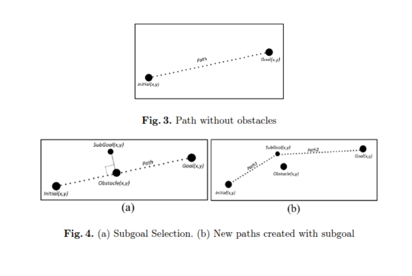

# STOx's Planner

STOx's Planner é um algoritmo de planejamento de caminho projetado para ambientes com obstáculos. Ele gera um caminho reto da posição inicial até a posição final e, quando detecta obstáculos, calcula um subobjetivo próximo ao obstáculo para dividir o caminho em subproblemas menores de forma recursiva.

## Como o Algoritmo Funciona

1. **Gera uma linha reta** da posição inicial até a posição final.
2. **Verifica a presença de obstáculos**:
   - Se o caminho intercepta um obstáculo:
     1. Gera um subobjetivo próximo ao obstáculo.
     2. Divide o caminho em dois subproblemas menores.
     3. Repete o processo recursivamente até que o obstáculo seja evitado.

